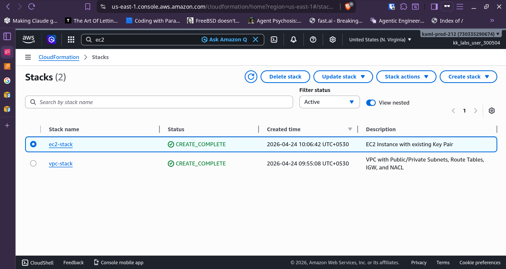
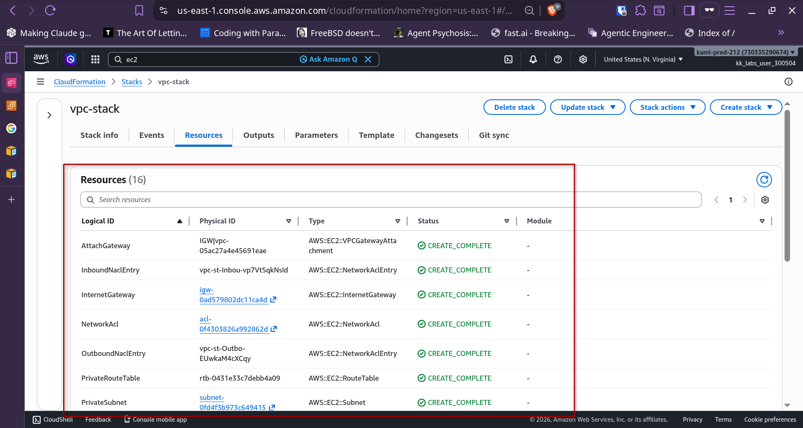
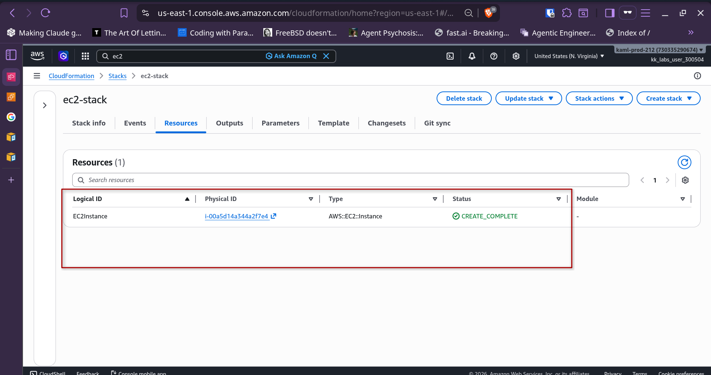
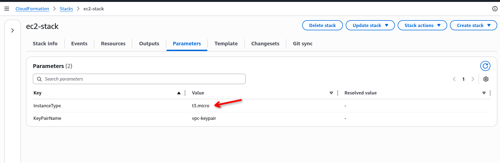
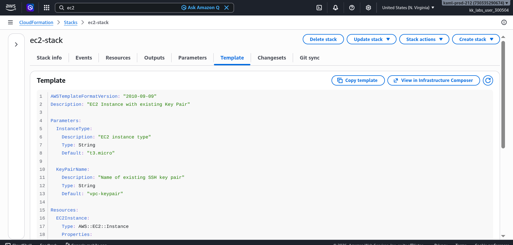
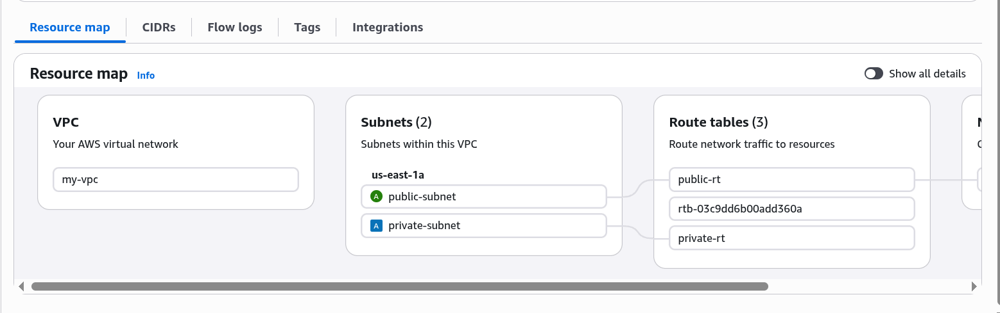
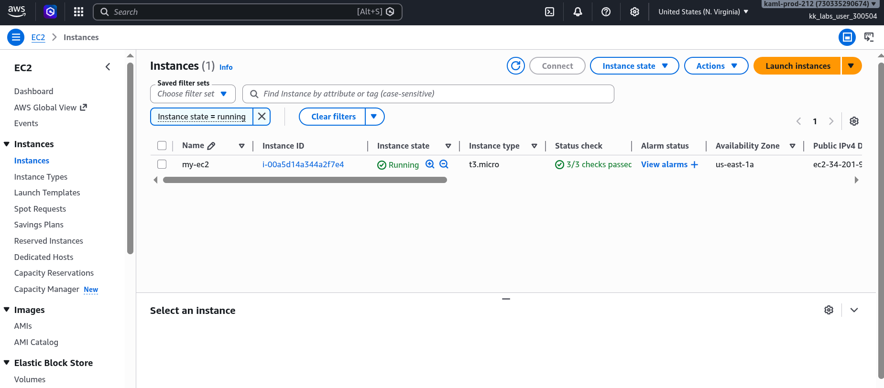

# AWS VPC and EC2 Setup via CloudFormation

This guide creates a VPC with public/private subnets, route tables, internet gateway, NACL, security group, and an EC2 instance using AWS CloudFormation.

## Screenshots

| Step | Screenshot | Description |
|------|------------|-------------|
| 1 |  | CloudFormation dashboard showing both stacks |
| 2 |  | VPC stack created resources |
| 3 |  | EC2 stack created resources |
| 4 |  | EC2 stack parameters configuration |
| 5 |  | EC2 stack template summary |
| 6 |  | VPC resource map showing topology |
| 7 |  | EC2 instance running with public IP |

## Architecture

```
Internet
    │
    ▼
┌─────────────────┐
│   Internet GW   │
└────────┬────────┘
         │
         ▼
┌─────────────────┐
│  Public Route   │◄──── Public Subnet (10.0.1.0/24)
│     Table       │
└────────┬────────┘
         │
         ▼
┌─────────────────┐
│ Private Route   │◄──── Private Subnet (10.0.2.0/24)
│     Table       │
└─────────────────┘
```

## Prerequisites

- AWS CLI configured with appropriate credentials
- AWS region: `us-east-1`

## Step 1: Create Key Pair

CloudFormation cannot generate key pairs directly (it can only reference existing ones). Create the key pair via CLI:

```bash
aws ec2 create-key-pair --key-name vpc-keypair --key-format pem \
  --query 'KeyMaterial' --output text > vpc-keypair.pem

chmod 400 vpc-keypair.pem
```

## Step 2: Create VPC Stack

The VPC stack creates:
- VPC (10.0.0.0/16)
- Public Subnet (10.0.1.0/24)
- Private Subnet (10.0.2.0/24)
- Internet Gateway
- Public Route Table (with IGW route)
- Private Route Table
- Network ACL (allow all)
- Security Group (SSH port 22 open)

```bash
aws cloudformation create-stack \
  --stack-name vpc-stack \
  --template-body file://vpc.yaml \
  --region us-east-1 \
  --capabilities CAPABILITY_IAM

aws cloudformation wait stack-create-complete \
  --stack-name vpc-stack --region us-east-1
```


## Step 3: Create EC2 Stack

The EC2 stack creates:
- EC2 Instance (t3.micro)
- Uses Amazon Linux 2 AMI
- Places instance in public subnet
- Associates with security group from VPC stack

```bash
aws cloudformation create-stack \
  --stack-name ec2-stack \
  --template-body file://ec2.yaml \
  --parameters ParameterKey=InstanceType,ParameterValue=t3.micro \
               ParameterKey=KeyPairName,ParameterValue=vpc-keypair \
  --region us-east-1

aws cloudformation wait stack-create-complete \
  --stack-name ec2-stack --region us-east-1
```


## Step 4: Verify Outputs


```bash
# VPC Stack Outputs
aws cloudformation describe-stacks \
  --stack-name vpc-stack \
  --query 'Stacks[0].Outputs' \
  --output table --region us-east-1

# EC2 Stack Outputs
aws cloudformation describe-stacks \
  --stack-name ec2-stack \
  --query 'Stacks[0].Outputs' \
  --output table --region us-east-1
```

## Step 5: Connect to EC2 Instance

```bash
ssh -i vpc-keypair.pem ec2-user@<EC2-Public-IP>
```

Example:
```bash
ssh -i vpc-keypair.pem ec2-user@34.201.9.218
```


## Cleanup

To delete all resources:

```bash
aws cloudformation delete-stack --stack-name ec2-stack --region us-east-1
aws cloudformation delete-stack --stack-name vpc-stack --region us-east-1
aws ec2 delete-key-pair --key-name vpc-keypair
rm vpc-keypair.pem
```

## Template Parameters

### vpc.yaml

| Parameter | Default | Description |
|-----------|---------|-------------|
| VPCCidr | 10.0.0.0/16 | CIDR block for VPC |
| PublicSubnetCidr | 10.0.1.0/24 | CIDR for public subnet |
| PrivateSubnetCidr | 10.0.2.0/24 | CIDR for private subnet |
| AvailabilityZone | us-east-1a | AZ for subnets |

### ec2.yaml

| Parameter | Default | Description |
|-----------|---------|-------------|
| InstanceType | t3.micro | EC2 instance type |
| KeyPairName | vpc-keypair | Existing SSH key pair name |


## Exports from VPC Stack

The VPC stack exports these values for the EC2 stack to consume:

| Export Name | Description |
|-------------|-------------|
| VPC-ID | VPC ID |
| Public-Subnet-ID | Public subnet ID |
| Private-Subnet-ID | Private subnet ID |
| Security-Group-ID | Security group ID |

## Security Considerations

- SSH (port 22) is open to 0.0.0.0/0 - restrict to your IP for production
- NACL allows all traffic (stateless) - adjust rules for production
- Consider placing EC2 in private subnet with bastion host for production